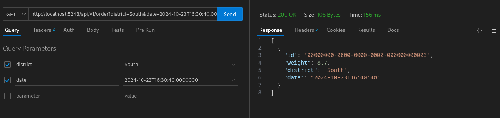
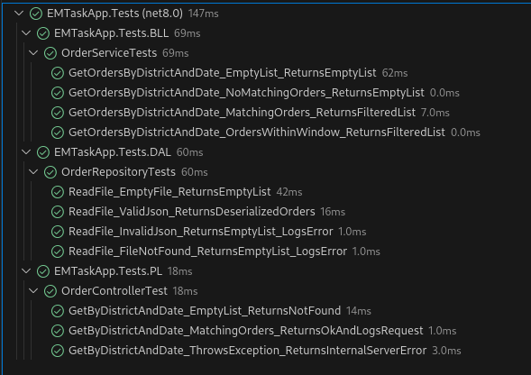

# Effective Mobile

Необходимо разработать консольное приложение (по желанию можно WinForms
либо WebApi) для службы доставки, которое фильтрует заказы в зависимости от
количества обращений в конкретном районе города и времени обращения с и по.

## О приложении
Реализовано простейший WebApi. 

Тестами покрыто. Использован Nunit.

Для логов использовано лёгенький package Serilog.Extensions.Logging.File. Логи пишутся в Logs/log-{дата}.txt
Дополнительно стандартным логам записываются обращения к API и поломки (например - отсутствие файла для чтения).

Трёхслойная архитектура:
* DAL - Один репозиторий, считывающий данные из файлa (DAL/Data.json).
* BLL - Один сервис, фильтрующий данные.
* PL - Один контроллер, принимающий из квори аргументы.

## API Reference

#### Получить заказы по району и от заданной даты до заданной даты + 30 минут

```http
GET /api/v1/order?district=South&date=2024-10-23T16:30:40.0000000
```

| Parameter | Type     | Description                |
| :-------- | :------- | :------------------------- |
| `district` | `string` | **Required**. Район |
| `date` | `DateTime` | **Required**. Дата и время |

## Пример


## Тесты
